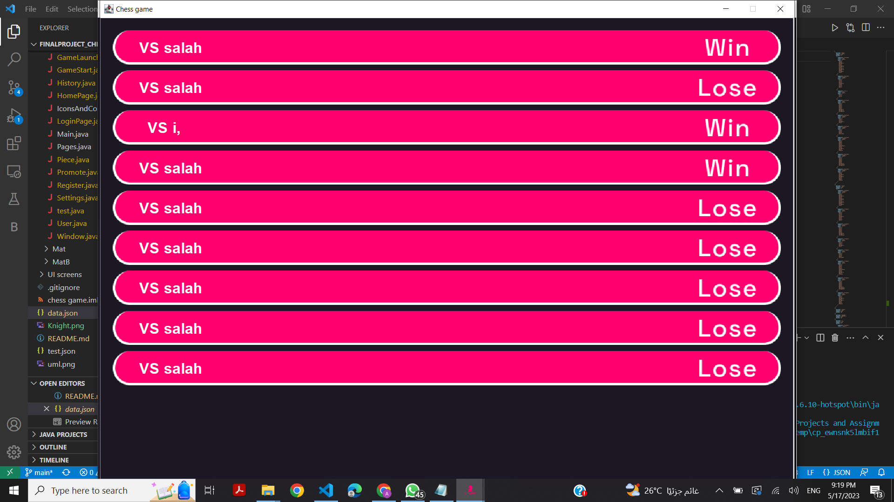

# Cool Forces Chess Game
## A Chess Game with interesting modification made to the typical chess rules 
### A brief intro
-This game has been done as a project for object oriented programming class at Cairo University Faculty of engineering, 
Systems and Biomedical Engineering Department. We used JAVA and google GSON library to handle as JSON file to save and extract data when
needed. The project is open-source, so feel free to use or download it.

### Team Members
https://github.com/bodaalaa2003 , https://github.com/TalalEmara ,  https://github.com/salahmohamed03   https://github.com/mostafa-aymann
,  https://github.com/Anasmo1323 

-The game has some uncommon but cool modifications made to the rules of chess. 
For example, The knight can still moves in L-Shape, but can now move 2 squares horizontally then 3 vertically or 3 horizontally and then 2 vertically. The following picture shows the available moves for the knight when it is selected.

### Important Feautures
-The game is highly functional and provides a friendly interface and smooth registration and login processes.

-Users concerned about their security have the option to avoid providing their username on the used pc and can play as a guest.

-Mathces analytics as ,number of matches ,win rate and number of wins are provided. Also you can find the whole history of matches of a user

and this user has his whole history of matches recorded ; each matched was played againest whom , moves , color and the ability to replay the match.

https://github.com/salahmohamed03/DrBassil-website/assets/93553073/f502980c-e2c3-4987-8404-a018fc316505

